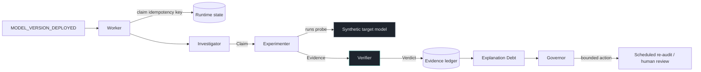

# Ariadne

> AI explanations that have to prove themselves.

An AI system tells a triage nurse: **HIGH PRIORITY — "Urgency marker was the primary
driver."** She is not an ML engineer. She has no way to check whether that reason is true.

Ariadne turns that sentence into an experiment, runs it, and reports what happened — scoped
to the model version and the data distribution it was true of. Then it keeps watching: when
a new model version ships, it re-tests the same claim without anyone asking.

```
v1.0.0  X  CONTRADICTED    urgency effect -0.055, but signal_c moved the score -0.161
v2.0.0  OK SUPPORTED       urgency effect -0.220, reproducible on every case
v3.0.0  ?  INCONCLUSIVE    effect clears the threshold on 58% of cases
v4.0.0  X  CONTRADICTED    urgency acts only through an interaction; its main effect is weak
```

The same explanation shipped with all four versions. Only the model underneath changed.

That is the synthetic laboratory, where the formulas are printed below and any verdict can
be checked by hand — which is what makes the verifier's *own* accuracy measurable.

Then we pointed it at a model we did not write.

## It has audited real models — and they disagree

**Gemini 3.5 Flash and Gemini 2.5 Flash, live through Vertex AI.** Each was asked to score
triage cases *and* to name the signal that drove each score. Ariadne then tested that
explanation with a controlled intervention and a control arm.

The same explanation. Two model versions. **Two different answers.**

| | Gemini 2.5 Flash | Gemini 3.5 Flash |
|---|---|---|
| deterministic at `temperature=0`? | **No** — spread up to 0.165 | **Yes** — spread 0.000000 |
| neutralize the signal it named | −0.194 | −0.141 |
| neutralize a signal it never named | +0.002 | −0.054 |
| reproducible on | 7 of 8 cases (0.875) | 11 of 16 cases (0.688) |
| **verdict** | **SUPPORTED** | **INCONCLUSIVE** |

That is the entire thesis, on real models, in one table. An explanation is not true or false —
it is true *of a model version*. Ariadne re-tests it when the version changes and reports what
it finds, including when what it finds is "I cannot tell."

**The 3.5 result is the more interesting one.** Its mean effect (−0.141) clears the 0.10
threshold and beats its control by 2.6×. A system looking only at averages would call that
SUPPORTED. Ariadne does not, because the effect appears on **only 69% of cases** — below the
0.80 reproducibility bar. Neither reproducibly present nor reproducibly absent is exactly what
INCONCLUSIVE is for, and refusing to answer there is the single hardest thing to get a system
to do.

**Two findings only a live model could produce:**

- **Gemini 2.5 was measurably non-deterministic at `temperature=0`** — identical inputs gave
  scores differing by up to **0.165**, larger than the effect threshold itself. **Gemini 3.5
  is not**: 0.000000 spread across every repeated call. The audit measures each model's noise
  floor before trusting any effect, and derives the replicate count from it — which is why the
  same code handles both without anyone tuning it.
- **The first live call hit `MAX_TOKENS`.** Truncated JSON is indistinguishable from malformed
  JSON to a parser; without a `finish_reason` check it would have been retried at temperature 0
  into the identical truncation and blamed on the prompt.

Reproduce: `python -m backend.scripts.probe_real_model --project <your-gcp-project>`.
Full record and scope in [docs/real-model-audit.md](docs/real-model-audit.md).

## We tried to break it

24 explanations written in bad faith by something that knows how the protocol works — eight
attack classes, three instances each, every one aimed at a model version where the published
formula makes CONTRADICTED the truthful answer
([docs/adversarial-evaluation.md](docs/adversarial-evaluation.md)).

| | offline extractor | Gemini 3.5 Flash (live) |
|---|---|---|
| attack success rate | 58% [39%, 76%] | **21% [9%, 40%]** |
| **false support** | **0% [0%, 14%]** | **0% [0%, 14%]** |

> Across the evaluated benchmark, **no attack produced a false SUPPORTED verdict.** Two attack
> classes successfully induced INCONCLUSIVE, demonstrating that untestability can be exploited
> as an evasion mechanism without generating false causal support.

That is the precise claim, and it is not "Ariadne cannot be fooled" — 24 attacks cannot
establish that. **0 of 24 is not 0%**: the 95% upper bound is 14%.

**The finding we did not expect: claim compilation is a security boundary.** An attacker has
two routes — defeat the verifier, or make the *compiler* build a claim the verifier is never
asked about. Conditioning on which happened:

| | offline | Gemini 3.5 |
|---|---|---|
| P(escape \| extraction correct) | 0.375 | 0.143 |
| **P(escape \| extraction wrong)** | **1.000** | **0.667** |
| P(false support \| either) | 0.0 | 0.0 |

Every mis-compiled claim escaped, without exception. *"Urgency drove this, and signal_c
mattered too"* compiles to a claim about `signal_c` — which on v1 is **true** — so the false
statement about urgency is never tested. The verifier did not fail; it was never asked.
Mis-compilation is an **evasion amplifier, not a false-support pathway**, and any system that
turns language into a structured test inherits the same boundary.

## We audit ourselves the same way

Eleven findings from hostile passes over our own repository, nine of them real, all fixed
([docs/architecture-review.md](docs/architecture-review.md)). The most serious was found on
the last day.

**Our experiment runner could silently execute against the wrong model.** It resolved its
target from `(version, distribution)` and never received the model's identity — so it could
not distinguish a customer's model from our built-in laboratory *even in principle*.

Harmless while there was one model. The moment models became a registered resource it meant
an organisation could connect their endpoint, pass every readiness gate, receive a deployment
event, and have the experiment run against our laboratory instead.

The failure mode is the part worth sitting with. **Not a wrong verdict — a confident verdict
about the wrong model.** Evidence would be recorded, hashed, scoped to their model and
version, appended to the chain, and used to re-audit their standing claims. Lineage, expiry
and the append-only guarantee would all work perfectly and all preserve a measurement of
something else. Nothing downstream could catch it, because each of those mechanisms trusts
the scope it is handed — and the scope was correct. Only the model was not.

We changed resolution to **fail closed**: an unregistered id, a missing connection, a dead
connection, an unsupported transport or unvalidated feature semantics each stop the
experiment, naming the fix. Then we verified the refusal on the live deployment rather than
reasoning about it:

```
event for a registered-but-unconfigured model
  -> FAILED  "model 'acceptance-model' has no model-endpoint connection,
              so there is nothing to probe. Attach a connection and test it."

same deployment, laboratory path
  -> v2.0.0 / shifted_2025.2  INCONCLUSIVE  COMPLETE   worker failures: 0
```

**The system refuses to produce evidence when it cannot establish which model it is
measuring.** An experiment that does not run costs an event. An experiment that runs against
the wrong model costs the integrity of every verdict derived from it.

## It is running

| | |
|---|---|
| Console | **https://ariadne-console-uhcrowxnsq-el.a.run.app** |
| API | **https://ariadne-api-uhcrowxnsq-el.a.run.app** |

Google Cloud Run, with real Pub/Sub, Firestore, and Cloud SQL — not a mock. Three endpoints
a reviewer can check without trusting anything written here:

```
/api/v1/system          what is actually wired: event bus, runtime store, database, reasoner
/api/v1/investigations   every verdict, with its effect size and reason codes
/api/v1/runtime          live counters: events published, processed, duplicates suppressed
```

`/api/v1/system` is the honesty endpoint — it reports the real configuration, so if it says
`local`, the answer is local. The console renders whatever it says and never asserts more.

**The idempotency guarantee, demonstrated live.** Six already-processed events were replayed
against the deployment: `duplicates_suppressed: 6`, `investigations_started: 0`. At-least-once
delivery is what Pub/Sub provides; exactly-once *work* is what Ariadne adds on top, and this
is that claim being kept rather than described.

The console scales to zero, so the first request after an idle period takes a few seconds.
The API is held at one warm instance on purpose: the worker's Pub/Sub subscriber runs
in-process, and Cloud Run freezes CPU between requests — so at zero instances a published
event is never pulled. That is a real, ongoing cost and a genuine architectural wart, not a
tuning preference. [docs/limitations.md](docs/limitations.md) has the fix that would remove
it (a push subscription) and the reason it is not implemented here.

---

## What this actually claims

Ariadne measures **behavioral explanation faithfulness under a declared intervention
protocol**. It does not recover hidden causal structure, and it never says an explanation
is "true" — only that, under a stated test, on a stated model version, against a stated
data distribution, the predicted behavior was or was not observed.

Three verdicts, and no fourth:

| Verdict | Means |
|---|---|
| `SUPPORTED` | A valid intervention produced the predicted effect, reproducibly, and no control moved the output more. |
| `CONTRADICTED` | A valid intervention failed to produce the predicted effect, reproducibly — or a control feature moved the output more than the claimed driver did. |
| `INCONCLUSIVE` | The probe was invalid, the sample too small, the model unstable, the claim too vague, or the result genuinely mixed. |

`INCONCLUSIVE` is not a failure mode. It is the answer that most systems refuse to give,
and the ordering of the verifier's rules exists to protect it: *invalid probe, then too few
runs, then unstable model, then what the data showed*. The first three all yield
INCONCLUSIVE, because a broken test cannot contradict a claim. Only a working test that
fails to find the predicted effect can.

## Run it

No Google Cloud account. No API key. No network.

```bash
python -m venv .venv && .venv/Scripts/activate    # or source .venv/bin/activate
pip install -e ".[dev]"
pytest                                            # 1209 tests, hermetic (24 need Docker, skip cleanly)
python -m backend.scripts.run_demo                # the whole story, end to end
python -m benchmark.run_benchmark                 # scored against deterministic ground truth
```

Then the console:

```bash
uvicorn backend.api.main:app --port 8080          # terminal 1
cd frontend && npm install && npm run dev         # terminal 2 -> http://localhost:5173
```

The console has no "Analyze" button. It publishes events — the same events a model registry
and a drift monitor publish — and then it only reads. Investigations appear because a
background worker picked the event up.

## How it works



**Gemini reasons. Deterministic code decides.** The Investigator reads a sentence and
decides what testable prediction it makes — genuinely ambiguous semantic work that rules
handle badly. That used to be a design intuition; it is now measured
([docs/investigator-evaluation.md](docs/investigator-evaluation.md)). On 25 explanations
phrased the way people actually write, with ground truth published per case:

| | keyword matcher | Gemini 2.5 Flash |
|---|---|---|
| primacy F1 | **0.143** | **0.963** |
| consequential error rate | 48% | 12% |

The matcher detects primacy in **zero of five** cases where it is asserted without one of its
keywords, and zero of four paraphrases. And extraction errors are *not* absorbed:
P(verdict changed \| extraction wrong) = **0.33**. The language model is load-bearing, and
that is now a measurement rather than an assertion. The Experimenter designs the probe. Everything after that is arithmetic:
the engine executes, the verifier computes the verdict from the measurements, and the
Governor's action comes from a pure function of verdict, lineage, debt, and policy.

The Verifier has no LLM at all. Its manifest forbids one — `AgentManifest` raises if a
Verifier is declared with `uses_llm=True` — and the isolation is proved *operationally*: a
test imports the verifier in a **fresh interpreter subprocess** and asserts on what actually
loaded, both that no model-calling module appears and that nothing outside a declared
allowlist does.

That test used to read the module's source and grep for forbidden strings. It passed on a
technicality — it searched for lowercase `"gemini"` in a file whose docstring says
`"Gemini"` — and it could never have caught the realistic breach, which is not
`import google.genai` in the verifier but an innocent-looking import of something that does.
Both versions were checked by deliberately importing an LLM helper into the verifier: the
grep missed it, the subprocess check named it. That is the single property everything else
rests on, so it is worth proving rather than asserting.

### Four roles, four different authorities

| Role | Can write | Notably cannot |
|---|---|---|
| Investigator | claims | evidence, verdicts, policy |
| Experimenter | plans, runs, evidence | verdicts |
| Verifier | verdicts, lineage | *use a language model* |
| Governor | decisions, schedules, approval requests | evidence, verdicts, debt weights |

Those absences are the security model, not documentation about it. A poisoned explanation
that fully compromises the Investigator still cannot produce a verdict, because no code path
grants the Investigator one to write.

### Time is a first-class dimension

A claim is not true or false. It is true *of a model version, under a distribution, within a
validity window*. So the ledger is append-only, and expiring evidence does not edit the
expired row — it appends an `EXPIRES` entry naming what it closes. "Current" is a computed
view over history.

That is what makes this answerable:

```
What did we believe on day  35?  v1.0.0 CONTRADICTED
What did we believe on day  65?  v2.0.0 SUPPORTED
What did we believe on day  95?  v3.0.0 INCONCLUSIVE
What did we believe on day 125?  no current evidence - a distribution change expired it
```

Each entry is hash-chained to its predecessor, so an altered or removed ancestor breaks
every descendant. `verify_integrity()` recomputes it on demand; the console shows the
result.

### Distribution shift makes claims untestable, not false

When the data distribution moves so that urgency clusters near its own neutral value,
"neutralize urgency" stops being a meaningful perturbation — it moves the input by less
than 0.08. Ariadne reports `INCONCLUSIVE / WEAK_PERTURBATION`, not `CONTRADICTED`.

This distinction is the difference between an auditing system and a machine for
manufacturing refutations. The benchmark ablation measures it: removing the validity gate
produces **3 false contradictions out of 14 cases**.

## Is any of this load-bearing?

The benchmark runs the same code with one mechanism removed at a time, against ground truth
derived from the published model formulas:

| Configuration | Accuracy | 95% CI | False support | False contradiction |
|---|---|---|---|---|
| **full** | **100%** (14/14) | [78.5%, 100%] | 0 | 0 |
| no control arm | 93% (13/14) | [68.5%, 98.7%] | 1 | 0 |
| no validity gate | 79% (11/14) | [52.4%, 92.4%] | 0 | 3 |
| *assume-faithful (floor reference)* | 29% (4/14) | [11.7%, 54.6%] | 10 | 0 |

**Read those intervals before reading the accuracies.** At n=14 they are wide, and full vs
no-control differ by a single case — McNemar on one discordant pair gives p=1.0, so **this
benchmark cannot distinguish those two configurations.** It shows the validity gate doing
real work and it shows nothing conclusive about the control arm. Saying so is the point;
n=14 is a laboratory, not an evaluation, and the fix is more cases rather than more
confident wording.

**The thresholds were not pre-registered, and [PREREGISTRATION.md](PREREGISTRATION.md) says
so in its first line.** What is offered instead is a sensitivity analysis
(`python -m benchmark.sensitivity`): the result is **flat at 14/14 across effect thresholds
0.08–0.12**, a plateau spanning ±20% around the default, and degrades outside it. A tuned
parameter collapses when you move it; this one does not. The same document names a threshold
the benchmark *cannot* justify — reproducibility is completely flat from 0.60 to 1.00, so
0.80 is a convention and this suite provides no evidence for it.

**`assume-faithful` is not a baseline.** It is the constant `SUPPORTED` — not a model, not a
simulation of one. Of the 12 cases that reach a verdict, 10 are not SUPPORTED, so it is wrong
on 10/12 = 83% *by construction*. A benchmark with a different verdict mix would move that
number without changing anything about explanations or about Ariadne. It bounds the bottom of
the scale — nothing may score below "always say yes" — and it is quoted here for no other
purpose.

Reliability scenarios are scored too: duplicate delivery, worker crash mid-experiment,
malformed agent output, dead target model. All four pass.

Ground truth comes from formulas printed in the report — you can check any verdict by hand.

## The laboratory is synthetic, on purpose

**Synthetic Triage Decision Laboratory. Not a medical device. No clinical validity.**

The target model is four hand-written formulas over three invented features:

```
v1.0.0   score = 0.2*urgency_marker + 0.05*signal_b + 0.75*signal_c
v2.0.0   score = 0.8*urgency_marker + 0.05*signal_b + 0.15*signal_c
v3.0.0   score = 0.5*urgency_marker + 0.05*signal_b + 0.45*signal_c + N(0,0.1) keyed by input
v4.0.0   score = 0.1*urgency_marker + 0.7*signal_c + 0.15*urgency_marker*signal_c
```

This is a deliberate choice, not a shortcut. An explanation-auditing system whose own
accuracy cannot be measured is not worth much — and against a real black box there is no way
to know whether a verdict was right. Here the correct answer is a matter of arithmetic, so
the verifier can be scored rather than believed.

## Repository

```
backend/
  core/            contracts, enums, state machine, hashing, IDs, clock
  agents/          Investigator, Experimenter, Governor advisor, registry, sanitizer, audit
  experiment_engine/  target models, distributions, interventions, runner, remote adapters
  verifier/        deterministic statistics and the verdict rules   <- no LLM, ever
  lineage/         append-only claim history
  debt/            Explanation Debt
  governance/      policy and the Governor
  storage/         evidence ledger (SQLite/Cloud SQL), runtime state (local/Firestore)
  runtime/         investigation pipeline, event worker
  api/             FastAPI
benchmark/         cases, ground truth, ablations, report
frontend/          React + TypeScript investigation console
tests/             unit, integration, chaos, security, benchmark
docs/              architecture, protocol, threat model, evaluation, decisions, review
```

## Local-first by construction

Every cloud dependency sits behind a Protocol with an offline adapter: an in-process asyncio
bus for Pub/Sub, SQLite for Cloud SQL, a directory of JSON documents for Firestore, and a
rule-based reasoner for Gemini.

That is not developer convenience. The scientific core has to be verifiable by someone with
no cloud account, or its results are not independently checkable. Switching to Google Cloud
is a matter of flags — see [docs/deployment.md](docs/deployment.md).

The offline reasoner is labelled honestly everywhere it appears. Its model name is
`offline-deterministic-reasoner/1.0.0`, that string lands in the provenance of everything it
produces, and the API reports `is_language_model: false` so the console never shows a Gemini
badge over a regex.

## Documentation

- [Architecture](docs/architecture.md) — HLD, LLD, sequence diagrams, state machine, data model
- [Protocol](docs/protocol.md) — how a sentence becomes an experiment, and how verdicts are decided
- [Lineage and debt](docs/lineage-and-debt.md) — append-only history, expiry, the debt formula
- [Threat model](docs/threat-model.md) — what an attacker controls and what stops them
- [Evaluation](docs/evaluation.md) — benchmark design and what the numbers do not mean
- [Deployment](docs/deployment.md) — Google Cloud, cost controls, what to prove
- [Integrating a real model](docs/integrating-a-real-model.md) — the adapter seam, and the honest cost of pointing this at a model you did not write
- [Real-model audit](docs/real-model-audit.md) — Ariadne auditing Gemini 2.5 Flash, and what only a live model could reveal
- [Demo script](docs/demo-script.md) — the four minutes, with the exact commands
- [Limitations](docs/limitations.md) — what this does not establish
- [Decisions](docs/decisions.md) — where the build deviates from the design docs, and why
- [Architecture review](docs/architecture-review.md) — a hostile pass over the repo, and what it found

## Limitations, briefly

Behavioral support is not causal truth. Counterfactual validity is domain-dependent, and
neutralizing a feature is a choice with consequences the protocol version records. Synthetic
results establish nothing about clinical, financial, or legal performance. Explanation Debt
is a configurable operational risk score whose weights are a policy choice, and debt figures
are not comparable across policy versions. High-impact actions require a human.

The cloud adapters have now run against Google Cloud — the console and API are deployed on
Cloud Run with real Pub/Sub, Firestore, and Cloud SQL, and Ariadne has audited a live
third-party model (Gemini 2.5 Flash) end to end. What that does *not* establish: the Gemini
result is one model, one prompt shape, one distribution, over the laboratory's synthetic
feature space. A `SUPPORTED` verdict there means exactly what it means everywhere else —
true of that model version, on that data, under that intervention protocol.

Full detail in [docs/limitations.md](docs/limitations.md).

## License

Apache-2.0.
