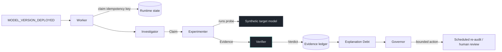

# Ariadne

> AI explanations that have to prove themselves.

An AI system tells a triage nurse: **HIGH PRIORITY — "Urgency marker was the primary
driver."** She is not an ML engineer. She has no way to check whether that reason is true.

Ariadne turns that sentence into an experiment, runs it, and reports what happened — scoped
to the model version and the data distribution it was true of. Then it keeps watching: when
a new model version ships, it re-tests the same claim without anyone asking.

```
v1.0.0  X  CONTRADICTED    urgency effect -0.055, but signal_c moved the score -0.161
v2.0.0  OK SUPPORTED       urgency effect -0.220, reproducible on every case
v3.0.0  ?  INCONCLUSIVE    effect clears the threshold on 58% of cases
v4.0.0  X  CONTRADICTED    urgency acts only through an interaction; its main effect is weak
```

The same explanation shipped with all four versions. Only the model underneath changed.

That is the synthetic laboratory, where the formulas are printed below and any verdict can
be checked by hand — which is what makes the verifier's *own* accuracy measurable.

Then we pointed it at a model we did not write.

## It has audited a real model

**Gemini 2.5 Flash, live, through Vertex AI — 68 real API calls.** Gemini was asked to score
triage cases *and* to say which signal drove each score. Ariadne then tested that
explanation:

```
Gemini's own explanation   "The high urgency_marker signal drove this score."

neutralize the signal it named        -0.194   reproducible on 7 of 8 cases
neutralize a signal it never named    +0.002   the control barely moved

VERDICT  SUPPORTED     the claimed driver outweighed its control by ~90x
```

Nobody knew that answer in advance. Two things only a live model could show:

- **Gemini is measurably non-deterministic at `temperature=0`** — identical inputs gave
  scores differing by up to **0.165**, larger than the 0.10 effect threshold. One call per
  case would have been measuring noise as much as signal, so the audit measures the model's
  noise floor first and derives the replicate count from it.
- **The first live call hit `MAX_TOKENS`.** Truncated JSON is indistinguishable from
  malformed JSON to a parser; without a `finish_reason` check it would have been retried at
  temperature 0 into the identical truncation and blamed on the prompt.

Reproduce it: `python -m backend.scripts.probe_real_model --project <your-gcp-project>`.
Full record and scope in [docs/real-model-audit.md](docs/real-model-audit.md).

## It is running

| | |
|---|---|
| Console | **https://ariadne-console-uhcrowxnsq-el.a.run.app** |
| API | **https://ariadne-api-uhcrowxnsq-el.a.run.app** |

Google Cloud Run, with real Pub/Sub, Firestore, and Cloud SQL — not a mock. Three endpoints
a reviewer can check without trusting anything written here:

```
/api/v1/system          what is actually wired: event bus, runtime store, database, reasoner
/api/v1/investigations   every verdict, with its effect size and reason codes
/api/v1/runtime          live counters: events published, processed, duplicates suppressed
```

`/api/v1/system` is the honesty endpoint — it reports the real configuration, so if it says
`local`, the answer is local. The console renders whatever it says and never asserts more.

**The idempotency guarantee, demonstrated live.** Six already-processed events were replayed
against the deployment: `duplicates_suppressed: 6`, `investigations_started: 0`. At-least-once
delivery is what Pub/Sub provides; exactly-once *work* is what Ariadne adds on top, and this
is that claim being kept rather than described.

Both services scale to zero, so the first request after an idle period takes a few seconds.

---

## What this actually claims

Ariadne measures **behavioral explanation faithfulness under a declared intervention
protocol**. It does not recover hidden causal structure, and it never says an explanation
is "true" — only that, under a stated test, on a stated model version, against a stated
data distribution, the predicted behavior was or was not observed.

Three verdicts, and no fourth:

| Verdict | Means |
|---|---|
| `SUPPORTED` | A valid intervention produced the predicted effect, reproducibly, and no control moved the output more. |
| `CONTRADICTED` | A valid intervention failed to produce the predicted effect, reproducibly — or a control feature moved the output more than the claimed driver did. |
| `INCONCLUSIVE` | The probe was invalid, the sample too small, the model unstable, the claim too vague, or the result genuinely mixed. |

`INCONCLUSIVE` is not a failure mode. It is the answer that most systems refuse to give,
and the ordering of the verifier's rules exists to protect it: *invalid probe, then too few
runs, then unstable model, then what the data showed*. The first three all yield
INCONCLUSIVE, because a broken test cannot contradict a claim. Only a working test that
fails to find the predicted effect can.

## Run it

No Google Cloud account. No API key. No network.

```bash
python -m venv .venv && .venv/Scripts/activate    # or source .venv/bin/activate
pip install -e ".[dev]"
pytest                                            # 881 tests, hermetic (24 need Docker, skip cleanly)
python -m backend.scripts.run_demo                # the whole story, end to end
python -m benchmark.run_benchmark                 # scored against deterministic ground truth
```

Then the console:

```bash
uvicorn backend.api.main:app --port 8080          # terminal 1
cd frontend && npm install && npm run dev         # terminal 2 -> http://localhost:5173
```

The console has no "Analyze" button. It publishes events — the same events a model registry
and a drift monitor publish — and then it only reads. Investigations appear because a
background worker picked the event up.

## How it works



**Gemini reasons. Deterministic code decides.** The Investigator reads a sentence and
decides what testable prediction it makes — genuinely ambiguous semantic work that rules
handle badly. The Experimenter designs the probe. Everything after that is arithmetic:
the engine executes, the verifier computes the verdict from the measurements, and the
Governor's action comes from a pure function of verdict, lineage, debt, and policy.

The Verifier has no LLM at all. Its manifest forbids one — `AgentManifest` raises if a
Verifier is declared with `uses_llm=True` — and a test reads the module's source to confirm
it imports nothing that could reach a model. That is the single property everything else
rests on: a published verdict can be recomputed from stored evidence by anyone, and it will
come out the same.

### Four roles, four different authorities

| Role | Can write | Notably cannot |
|---|---|---|
| Investigator | claims | evidence, verdicts, policy |
| Experimenter | plans, runs, evidence | verdicts |
| Verifier | verdicts, lineage | *use a language model* |
| Governor | decisions, schedules, approval requests | evidence, verdicts, debt weights |

Those absences are the security model, not documentation about it. A poisoned explanation
that fully compromises the Investigator still cannot produce a verdict, because no code path
grants the Investigator one to write.

### Time is a first-class dimension

A claim is not true or false. It is true *of a model version, under a distribution, within a
validity window*. So the ledger is append-only, and expiring evidence does not edit the
expired row — it appends an `EXPIRES` entry naming what it closes. "Current" is a computed
view over history.

That is what makes this answerable:

```
What did we believe on day  35?  v1.0.0 CONTRADICTED
What did we believe on day  65?  v2.0.0 SUPPORTED
What did we believe on day  95?  v3.0.0 INCONCLUSIVE
What did we believe on day 125?  no current evidence - a distribution change expired it
```

Each entry is hash-chained to its predecessor, so an altered or removed ancestor breaks
every descendant. `verify_integrity()` recomputes it on demand; the console shows the
result.

### Distribution shift makes claims untestable, not false

When the data distribution moves so that urgency clusters near its own neutral value,
"neutralize urgency" stops being a meaningful perturbation — it moves the input by less
than 0.08. Ariadne reports `INCONCLUSIVE / WEAK_PERTURBATION`, not `CONTRADICTED`.

This distinction is the difference between an auditing system and a machine for
manufacturing refutations. The benchmark ablation measures it: removing the validity gate
produces **3 false contradictions out of 14 cases**.

## Is any of this load-bearing?

The benchmark runs the same code with one mechanism removed at a time, against ground truth
derived from the published model formulas:

| Configuration | Accuracy | False support | False contradiction |
|---|---|---|---|
| **full** | **100%** (14/14) | 0 | 0 |
| no control arm | 93% | 1 | 0 |
| no validity gate | 79% | 0 | 3 |
| trust the model's own explanation | 29% | 10 | 0 |

Reliability scenarios are scored too: duplicate delivery, worker crash mid-experiment,
malformed agent output, dead target model. All four pass.

Ground truth comes from formulas printed in the report — you can check any verdict by hand.

## The laboratory is synthetic, on purpose

**Synthetic Triage Decision Laboratory. Not a medical device. No clinical validity.**

The target model is four hand-written formulas over three invented features:

```
v1.0.0   score = 0.2*urgency_marker + 0.05*signal_b + 0.75*signal_c
v2.0.0   score = 0.8*urgency_marker + 0.05*signal_b + 0.15*signal_c
v3.0.0   score = 0.5*urgency_marker + 0.05*signal_b + 0.45*signal_c + N(0,0.1) keyed by input
v4.0.0   score = 0.1*urgency_marker + 0.7*signal_c + 0.15*urgency_marker*signal_c
```

This is a deliberate choice, not a shortcut. An explanation-auditing system whose own
accuracy cannot be measured is not worth much — and against a real black box there is no way
to know whether a verdict was right. Here the correct answer is a matter of arithmetic, so
the verifier can be scored rather than believed.

## Repository

```
backend/
  core/            contracts, enums, state machine, hashing, IDs, clock
  agents/          Investigator, Experimenter, Governor advisor, registry, sanitizer, audit
  experiment_engine/  target models, distributions, interventions, runner, remote adapters
  verifier/        deterministic statistics and the verdict rules   <- no LLM, ever
  lineage/         append-only claim history
  debt/            Explanation Debt
  governance/      policy and the Governor
  storage/         evidence ledger (SQLite/Cloud SQL), runtime state (local/Firestore)
  runtime/         investigation pipeline, event worker
  api/             FastAPI
benchmark/         cases, ground truth, ablations, report
frontend/          React + TypeScript investigation console
tests/             unit, integration, chaos, security, benchmark
docs/              architecture, protocol, threat model, evaluation, decisions, review
```

## Local-first by construction

Every cloud dependency sits behind a Protocol with an offline adapter: an in-process asyncio
bus for Pub/Sub, SQLite for Cloud SQL, a directory of JSON documents for Firestore, and a
rule-based reasoner for Gemini.

That is not developer convenience. The scientific core has to be verifiable by someone with
no cloud account, or its results are not independently checkable. Switching to Google Cloud
is a matter of flags — see [docs/deployment.md](docs/deployment.md).

The offline reasoner is labelled honestly everywhere it appears. Its model name is
`offline-deterministic-reasoner/1.0.0`, that string lands in the provenance of everything it
produces, and the API reports `is_language_model: false` so the console never shows a Gemini
badge over a regex.

## Documentation

- [Architecture](docs/architecture.md) — HLD, LLD, sequence diagrams, state machine, data model
- [Protocol](docs/protocol.md) — how a sentence becomes an experiment, and how verdicts are decided
- [Lineage and debt](docs/lineage-and-debt.md) — append-only history, expiry, the debt formula
- [Threat model](docs/threat-model.md) — what an attacker controls and what stops them
- [Evaluation](docs/evaluation.md) — benchmark design and what the numbers do not mean
- [Deployment](docs/deployment.md) — Google Cloud, cost controls, what to prove
- [Integrating a real model](docs/integrating-a-real-model.md) — the adapter seam, and the honest cost of pointing this at a model you did not write
- [Real-model audit](docs/real-model-audit.md) — Ariadne auditing Gemini 2.5 Flash, and what only a live model could reveal
- [Demo script](docs/demo-script.md) — the four minutes, with the exact commands
- [Limitations](docs/limitations.md) — what this does not establish
- [Decisions](docs/decisions.md) — where the build deviates from the design docs, and why
- [Architecture review](docs/architecture-review.md) — a hostile pass over the repo, and what it found

## Limitations, briefly

Behavioral support is not causal truth. Counterfactual validity is domain-dependent, and
neutralizing a feature is a choice with consequences the protocol version records. Synthetic
results establish nothing about clinical, financial, or legal performance. Explanation Debt
is a configurable operational risk score whose weights are a policy choice, and debt figures
are not comparable across policy versions. High-impact actions require a human.

The cloud adapters have now run against Google Cloud — the console and API are deployed on
Cloud Run with real Pub/Sub, Firestore, and Cloud SQL, and Ariadne has audited a live
third-party model (Gemini 2.5 Flash) end to end. What that does *not* establish: the Gemini
result is one model, one prompt shape, one distribution, over the laboratory's synthetic
feature space. A `SUPPORTED` verdict there means exactly what it means everywhere else —
true of that model version, on that data, under that intervention protocol.

Full detail in [docs/limitations.md](docs/limitations.md).

## License

Apache-2.0.
