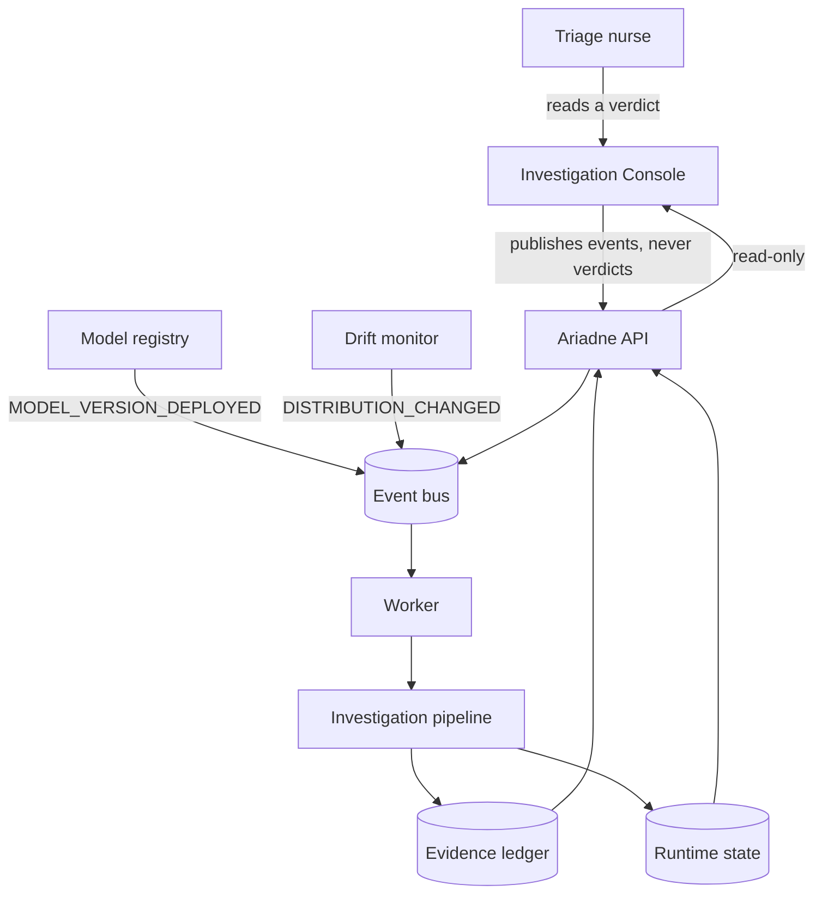
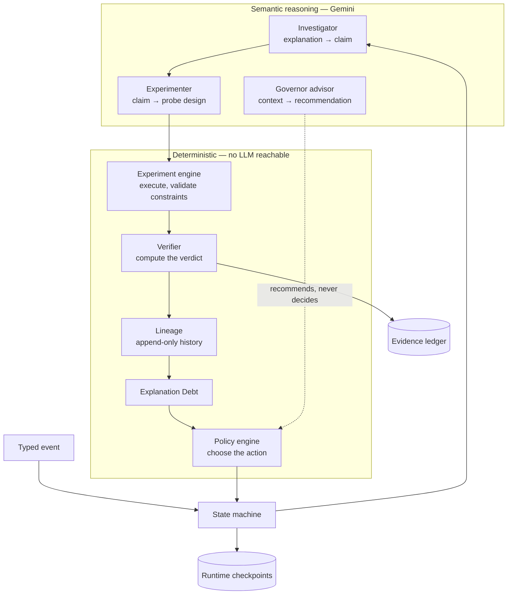
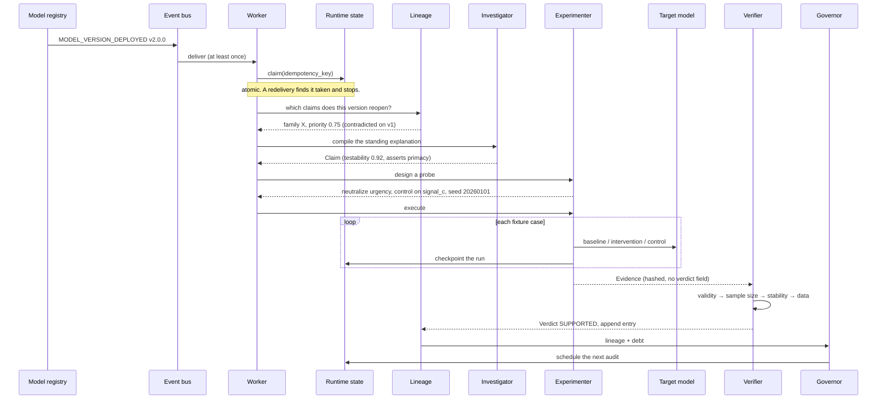
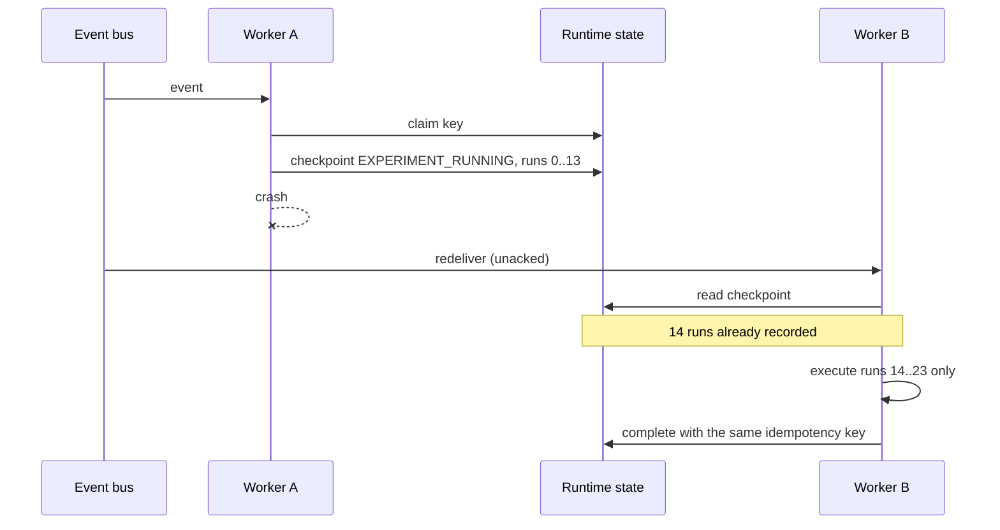
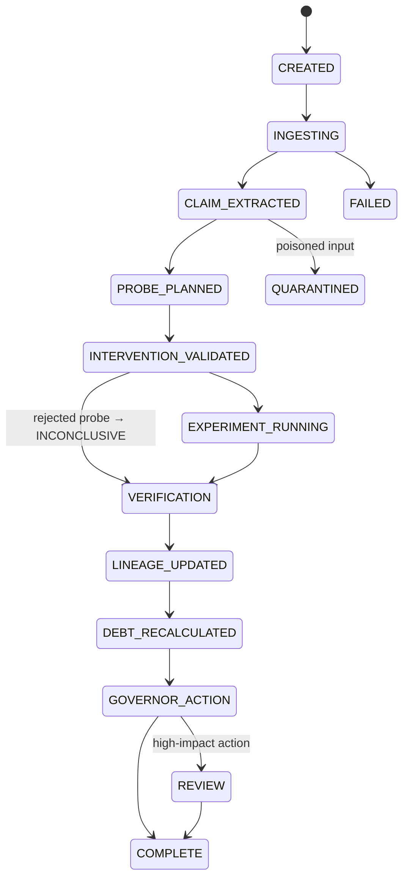
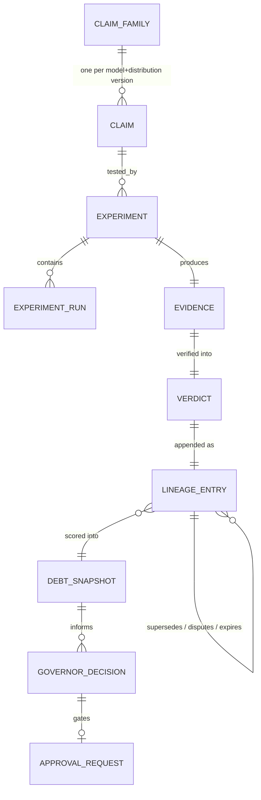
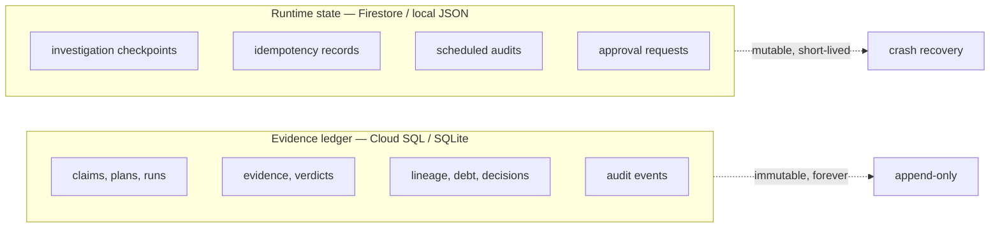

# Architecture

Every diagram below is followed by what it is actually asserting, because a diagram that
only shows boxes is a diagram that cannot be wrong.

---

## System context

**What to notice.** The console has exactly two arrows out: it publishes events and it
reads. There is no path from the UI to a verdict. The nurse's screen is a view of the
ledger, so nothing it displays can be true only on screen.

Note also who *starts* work: the model registry, not a person. The console can emit the same
event for a demo, but the production trigger is a deployment.

---

## High-level architecture

**What to notice.** The dotted line is the whole architectural argument. The advisor's
recommendation reaches the policy engine as *data* that gets recorded next to the enforced
action, not as control flow. `GovernorDecision` carries both `recommendation` and
`recommendation_accepted`, and the schema refuses to let those two disagree with the action
— so "the model wanted to do nothing and policy overruled it" is a queryable fact.

Everything downstream of the engine is arithmetic. A reviewer can recompute any verdict from
the stored evidence.

---

## The autonomous audit

**What to notice.** Three things happen before any science: the worker claims the
idempotency key, consults lineage, and checkpoints. That ordering is what makes the audit
both *targeted* — a claim contradicted on v1 is the one re-tested first — and *safe under
redelivery*.

Note what `Evidence` carries to the Verifier: measurements and hashes, and no verdict field.
The object that records observations is structurally unable to record a conclusion.

---

## Crash recovery

**What to notice.** Worker B does not restart the experiment. Every run is checkpointed as
it completes, and run IDs are content-addressed — `run_id(experiment, kind, index)` — so a
re-executed run resolves to the same identity. `ExperimentResult.runs_reused` reports how
many were restored, and the test suite asserts on it.

This is why resumption cannot inflate a sample size, which would silently change a verdict.

---

## Investigation state machine

**What to notice.** There is no edge from `CLAIM_EXTRACTED` to `VERIFICATION`. Reaching a
verdict without running an experiment is not discouraged, it is unreachable: every
transition goes through `assert_transition`, which raises on anything the table does not
allow. A test asserts that specific edge is absent.

The `INTERVENTION_VALIDATED → VERIFICATION` shortcut is deliberate. A rejected probe is
INCONCLUSIVE evidence, not a crash.

---

## Data model

**What to notice.** `CLAIM_FAMILY` is the spine of the temporal story. A family ID is
derived from `(model_id, subject, predicate, object)` and deliberately *excludes* the
version — that exclusion is what lets one claim be followed from v1 to v4 instead of
becoming four unrelated records.

The self-referential edge on `LINEAGE_ENTRY` is how append-only works. Nothing is updated;
a new row states its relation to an old one.

---

## Storage split

**What to notice.** These are split because they have opposite lifecycles. Runtime state is
mutable and exists so a crashed worker can resume; evidence is immutable and exists forever.
Mixing them is how "we resumed the worker" turns into "we rewrote the verdict".

The ledger exposes no `update_*` or `delete_*` method at all — a test asserts that its
public surface contains none.

---

## What is deliberately not here

- **No message queue between agents.** Agents are called in-process by the pipeline. Putting
  a broker between them would add operational surface without changing a failure boundary,
  since the pipeline is already resumable.
- **No vector store or RAG.** Nothing here needs semantic retrieval; lineage lookups are
  exact queries on a claim family ID.
- **No separate rules service.** Policy is a frozen dataclass with a version. A service would
  make it mutable at runtime, which is precisely what the versioning exists to prevent.
