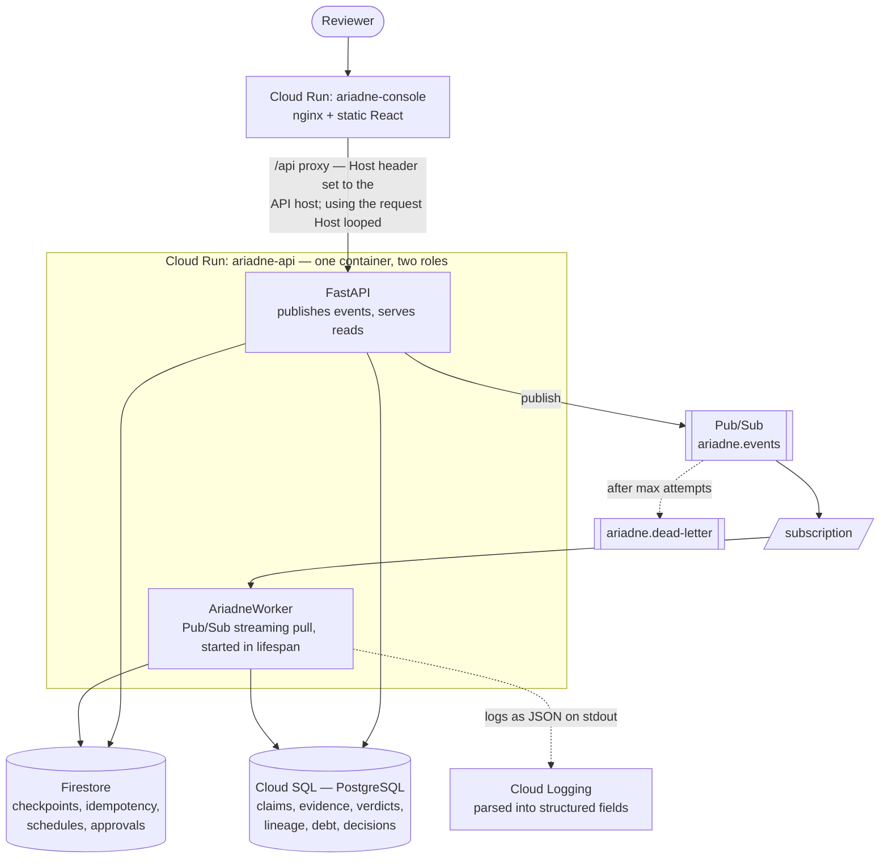

# Deployment

Ariadne runs fully offline by default. Cloud services are opt-in, one flag at a time, and
each has an adapter behind the same Protocol as its local counterpart.

| Concern | Local (default) | Google Cloud |
|---|---|---|
| Reasoning | offline deterministic reasoner | Vertex AI Gemini |
| Event bus | in-process asyncio | Pub/Sub + dead-letter topic |
| Evidence ledger | SQLite under `var/` | Cloud SQL (PostgreSQL) |
| Runtime state | directory of JSON documents | Firestore |
| Artifacts | `var/artifacts` | Cloud Storage |
| Logs | structured JSON on stdout | Cloud Logging (parses it natively) |
| Identity | in-process manifests | IAM service accounts, one per role |

The local core is not a mock. It provides real at-least-once delivery, real retries and
dead-lettering, real atomic idempotency claims, and real durable checkpoints. That matters:
the reliability properties are exercised by the test suite on every run, not only when
someone has a cloud project.

## What is currently deployed

| | |
|---|---|
| Console | https://ariadne-console-uhcrowxnsq-el.a.run.app |
| API | https://ariadne-api-uhcrowxnsq-el.a.run.app |
| Project / region | `ariadne-12` / `asia-south1` |



**What to notice.** The API and the worker are the *same container* — the same image, a
different entry path. That is deliberate: a worker built separately could drift from the code
that produced the evidence the API serves.

It is also the source of the deployment's one real architectural wart. Because the
subscriber runs in-process inside the service's `lifespan`, Cloud Run's default behaviour of
freezing CPU between requests stops it pulling. See **Cost control** below and
`docs/limitations.md` for the fix that is not implemented here.

## Switching on the cloud

```bash
ENABLE_GOOGLE_CLOUD=true
GCP_PROJECT_ID=your-project
GCP_REGION=asia-south1

LLM_PROVIDER=gemini
USE_VERTEX_AI=true            # or set GOOGLE_API_KEY

EVENT_BUS=pubsub
RUNTIME_STORE=firestore
DATABASE_URL=postgresql+psycopg://ariadne:...@/ariadne?host=/cloudsql/PROJECT:REGION:INSTANCE
```

`Settings` validates these together and refuses incoherent combinations — `EVENT_BUS=pubsub`
without `ENABLE_GOOGLE_CLOUD` raises at startup rather than failing later at the first
publish.

## Order

```
enable APIs
  → Artifact Registry
  → service accounts (one per role)
  → Cloud SQL instance + database
  → Firestore database
  → Pub/Sub topics, subscriptions, dead-letter policy
  → build and push the image
  → deploy the worker
  → deploy the API
  → deploy the console to Cloud Run or a bucket
  → emit a MODEL_VERSION_DEPLOYED event
  → capture logs and proof
```

```bash
gcloud builds submit --config infra/cloudbuild/cloudbuild.yaml
cd infra/terraform && terraform init && terraform apply -var project_id=$GCP_PROJECT_ID
```

## Service accounts

One per role, with the minimum each needs:

| Service account | Grants |
|---|---|
| `ariadne-investigator` | Vertex AI user; Cloud SQL client (read) |
| `ariadne-experimenter` | Cloud SQL client (write evidence); Firestore user |
| `ariadne-verifier` | Cloud SQL client (write verdicts and lineage). **No Vertex AI.** |
| `ariadne-governor` | Cloud SQL client (write decisions); Pub/Sub publisher |

The Verifier having no Vertex AI grant is the deployment-level expression of the same rule
its manifest enforces in code. If someone bypassed the manifest, IAM would still refuse.

## What the demo should prove

Each of these is observable, not asserted:

| Claim | How to show it |
|---|---|
| Cloud Run is serving | `/health` from the deployed URL; the revision in the console |
| Pub/Sub delivered an event | subscription metrics, plus `event_id` in the worker's logs |
| Vertex AI was called | `/api/v1/system` reports `is_language_model: true` and the model name; provenance on the claim carries it |
| Firestore holds checkpoints | `/api/v1/runtime` → `checkpoints`; the Firestore console |
| Cloud SQL holds evidence | `/api/v1/runtime` → `ledger` row counts |
| Logging shows the workflow | filter by `trace_id` for one investigation across all four agents |
| Duplicate events are safe | `/api/v1/runtime` → `duplicates_suppressed` while ledger counts hold |

**Do not claim a service is running unless it is.** `/api/v1/system` reports the real
configuration, and the console's honesty bar shows it — if it says `local`, say local.

**Every row above has been captured for real**, against `ariadne-12` on 2026-08-28:
`/health` and `/api/v1/system` served correctly; `MODEL_VERSION_DEPLOYED` events published
through a real topic were picked up by the real worker with no request in flight from the
caller; `/api/v1/runtime` showed `bus.published: 4`, `worker.investigations_started: 3`,
`duplicates_suppressed: 1` after an explicit duplicate-publish request, `checkpoints.runs:
144`, and a full evidence ledger with matching claim/verdict/lineage counts; an investigation
against v4.0.0 reached `CONTRADICTED` with the correct reason codes
(`CONTROL_DOMINATES`, `PRIMACY_REFUTED`); the Governor scheduled a real re-audit
(`reason_code: CURRENT_CONTRADICTION`) and opened a real approval request.

**The Vertex AI row needs splitting, because the two Gemini surfaces have different
answers.** Gemini as the *target being audited* has run for real: 68 live Vertex AI calls,
recorded in `docs/real-model-audit.md`. Gemini as the *Investigator* has not — this proof
pass used `LLM_PROVIDER=stub` deliberately, for a clean zero-cost run, and the deployment
still reports `reasoner.provider = "stub"` on `/api/v1/system` today. Anyone can check that
in a browser, which is the point of the endpoint. See `docs/limitations.md` for what that
deployment also
surfaced: the worker needs `--min-instances=1 --no-cpu-throttling` to reliably process events
without a request in flight (three real infrastructure bugs were found and fixed getting a
single event to process correctly - a missing `google_sql_user`, a Cloud Build substitution
that only resolves inside step args, and a missing `roles/pubsub.subscriber` grant on the
identity the worker runs as).

## Observability

Every log line is one JSON object carrying `trace_id`, `event_id`, `idempotency_key`,
`investigation_id`, `agent_id`, `model_version`, `distribution_version`, `state`,
`input_hash`, `output_hash`, `latency_ms`, `retries`, and `estimated_cost_usd`. Cloud Logging
parses JSON on stdout into structured fields, so those become queryable with no shipping
agent.

The cost field is an **estimate** from token counts and published list prices, labelled as
such everywhere it appears. It is not billing data.

## Cost control

This is a hackathon budget, and the design assumes it:

- **Flash-first.** `gemini-2.5-flash` by default; the reasoning calls are small and structured.
- **Three LLM calls per investigation**, not a conversation loop. The `loop_budget` caps
  retries at 3 and then quarantines rather than spinning.
- **The target model is arithmetic.** Experiment execution costs nothing — 72 model calls per
  investigation, all local float operations.
- **Scale to zero for the API path; the always-listening worker is a real, separate cost.**
  Cloud Run's own default is min instances 0, max 2, and that is exactly right for request
  handling. But `AriadneWorker`'s Pub/Sub subscriber runs in-process in the same service's
  `lifespan`, and Cloud Run freezes CPU between requests - a real deployment found that a
  published event simply never got processed until the service was given
  `--min-instances=1 --no-cpu-throttling`. Keeping one small always-on instance is cheap
  (a fraction of `db-f1-micro`'s own cost) but it is not zero, and the docs should not imply
  it is. See `docs/limitations.md` for the architecturally correct fix (a Pub/Sub push
  subscription instead of a background pull loop), not implemented here.
- **Smallest SQL tier** (`db-f1-micro`); the evidence ledger is tiny.
- **`--fail-on-regression` for CI**, not a large benchmark sweep.
- **Budget alert** at a fixed threshold, and disable services after capturing proof.

The offline reasoner keeps development and CI at zero LLM cost, which is most of the saving.

## Local production-ish run

```bash
docker build -t ariadne .
docker run -p 8080:8080 -e DEFAULT_REPETITIONS=24 ariadne
```

The same image serves the API and, with a different command, the worker — so the worker can
never drift from the code that produced the evidence the API serves.
