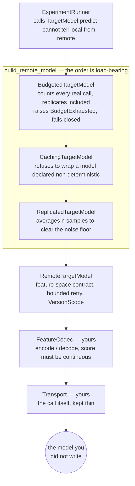

# Integrating a real target model

The synthetic laboratory exists so the verifier's own accuracy is checkable — the formulas
are printed on the page, so "what would a faithful explanation be?" is not a matter of
opinion. This document is about the other direction: pointing Ariadne at a model you did not
write and cannot see inside.

`backend/experiment_engine/adapters.py` is that seam. Nothing in it changes what a verdict
means. The `TargetModel` protocol is unchanged and the experiment engine cannot tell a remote
model from the in-process one — `tests/unit/test_adapters.py::TestTransparentToTheProtocol`
asserts exactly that, by running the same synthetic v1.0.0 model through the full remote
stack and requiring the identical `CONTRADICTED` verdict with the identical reason codes.

---

## What you have to supply

Three things, in descending order of how much thought they need.

### 1. A feature space — this is the real cost, and it cannot be automated

Ariadne's protocol is *"neutralize X while preserving Y, and see whether the decision
moves."* That sentence only means something over a structured feature space where each
feature has a declared **neutral value**. A model that takes free-form text has no such
space, and no amount of adapter code invents one.

So you declare it:

```python
from backend.experiment_engine.distributions import FeatureSpec

SPACE = {
    "recent_spend": FeatureSpec(
        name="recent_spend", minimum=0.0, maximum=1.0, neutral_value=0.5,
        description="Normalised 30-day spend percentile.",
    ),
    "account_age": FeatureSpec(
        name="account_age", minimum=0.0, maximum=1.0, neutral_value=0.5,
        description="Normalised account age.",
    ),
}
```

**`neutral_value` is a domain judgement, and it is the single most consequential number you
will supply.** It defines what the intervention *is*. Get it wrong and every effect size is
measured against the wrong counterfactual — the arithmetic will still work and the verdicts
will still look authoritative. `docs/limitations.md` covers why a neutral value can be
ill-defined in some domains; if you cannot defend yours, Ariadne is the wrong tool for that
feature.

The adapter refuses to construct without a space, rather than defaulting to something
plausible:

```
ValidationError: a remote target model needs a declared feature space; without neutral
values per feature, 'neutralize this feature' has no defined meaning
```

### 2. A `FeatureCodec` — translation to your model's wire format

```python
class MyCodec:
    def encode(self, features):
        return {"inputs": {k: float(v) for k, v in features.items()}}

    def decode(self, payload):
        return RawPrediction(
            score=payload["risk_score"],       # must be CONTINUOUS
            decision=payload["label"],
            explanation=payload.get("reason", ""),
        )
```

**`score` must be continuous and comparable across calls.** The entire protocol measures *how
far* a decision moved. A codec that decodes only a hard class label throws away the signal the
verifier reasons about — every delta collapses to 0 or ±1 and reproducibility becomes noise.
If your model only emits a class, decode the probability or logit for the class of interest
instead.

### 3. A `Transport` — how the call is actually made

```python
transport = HttpTransport(url="https://models.internal/predict",
                          headers={"Authorization": f"Bearer {token}"})
```

`HttpTransport` is a thin reference implementation. Most teams substitute their own SDK
client. Keep it thin: no retry loop of your own (the adapter has one, and two loops
multiply), no response interpretation (that is the codec's job).

---

## Onboarding a model: measure before you trust

Run this **once**, before believing any verdict. It answers the two questions you would
otherwise have to guess at.

```python
from backend.experiment_engine.adapters import measure_noise_floor, replicates_needed

profile = measure_noise_floor(model, cases=my_fixture_cases[:5], samples=5)
print(profile.looks_deterministic, profile.sd, profile.max_spread)
```

**If `looks_deterministic` is True** — repeated identical calls agreed to floating-point noise
— set `deterministic=True` on the identity and caching becomes both safe and free money.

**If it is False**, the model disagrees with itself, and you need to know by how much before
any effect size is meaningful:

```python
n = replicates_needed(profile.sd, min_effect_threshold=0.10)
```

The mean of *n* samples has standard error `sd / sqrt(n)`, so requiring the effect threshold
to sit at least 4 standard errors clear of the noise gives `n >= (4·sd / threshold)²`. The
cost is quadratic and that is the point — it is the price signal you need *before* committing:

| Measured `sd` | Threshold | Replicates needed | Calls per investigation |
|---|---|---|---|
| 0.000 | 0.10 | 1 | 74 |
| 0.025 | 0.10 | 1 | 74 |
| 0.050 | 0.10 | 4 | 296 |
| 0.100 | 0.10 | 16 | 1,184 |

A model whose noise equals the effect you are trying to detect costs **16×** to audit. That is
not a flaw in the method; it is the honest price of measuring a small effect through a noisy
instrument, and it is better known up front than discovered in a bill.

Also set the plan's gate from the measurement rather than the default:

```python
plan = plan.model_copy(
    update={"instability_threshold": profile.suggested_instability_threshold()}
)
```

---

## Assembling it

`build_remote_model` composes the layers in the one order that is correct:

```python
model = build_remote_model(
    identity=ModelIdentity(
        model_id="fraud-scorer",
        version="4.2.0",
        distribution_version="prod_2026Q1",
        deterministic=profile.looks_deterministic,   # measured, not assumed
    ),
    codec=MyCodec(),
    transport=transport,
    feature_space=SPACE,
    max_calls=500,
    cost_per_call=0.0004,
    max_spend=1.00,
    replicates=n,
)
```



Budget outermost (so it counts every real call, including replicates), cache inside it (so
hits cost nothing and are not billed), replication innermost (so it is what actually talks to
the network).

**Each of those orderings is a bug if reversed.** Budget inside replication would count one
call where five were billed. Cache outside budget would let a cached hit consume budget it
never spent. And caching *below* replication would return the same stored answer n times —
turning a measurement of the model's self-disagreement into a measurement of the cache. That
last one is why `CachingTargetModel` refuses a model whose identity declares
`deterministic=False` rather than trusting the caller to compose correctly: a cache over a
stochastic model reports perfect stability for a model that has none, which is a silent false
negative on the gate protecting verdict integrity.

Then hand it to the engine exactly like the synthetic one:

```python
runner = ExperimentRunner(model_factory=lambda *_a, **_k: model)
```

---

## The three failure modes, and what each does

| Situation | Behaviour | Why |
|---|---|---|
| Transient network failure | Retried up to `RetryPolicy.max_attempts` with capped exponential backoff | Genuinely transient |
| Malformed response (codec raises `ValidationError`) | **Not retried**, raised immediately | A contract violation reproduces identically; retrying only spends budget |
| Budget or spend cap reached | `BudgetExhausted`, **not retryable**, experiment aborts | See below |

**Why budget exhaustion aborts rather than truncating.** An experiment that quietly ran 9 of
its declared 24 cases would produce evidence whose sample size contradicts its own plan, and
the verifier would then apply a reproducibility threshold to a sample nobody authorised. It
fails closed instead.

This also surfaced a real bug in the engine, worth recording: `ExperimentRunner._execute`
wrapped *every* exception into `TargetModelError`, which is marked retryable. A budget
exhaustion would therefore have been relabelled as retryable — telling the worker to try
again at exactly the moment retrying is guaranteed to fail and to cost more money. The runner
now inspects `AriadneError.retryable` and lets non-retryable errors through untouched.

---

## Caching is gated on determinism, deliberately

`CachingTargetModel` **refuses** to wrap a model declared non-deterministic:

```
ValidationError: refusing to cache a model declared non-deterministic: caching would serve
one sample repeatedly and make the instability probe report perfect stability for a model
that has none.
```

This is not defensive over-engineering. The runner calls the model twice on identical input
specifically to detect self-disagreement, and the verifier refuses to issue a verdict when
that disagreement is large. A cache would return the first sample both times and report
perfect stability for a model that has none — a silent false negative on the exact gate that
protects verdict integrity. Prevented in code rather than documented as a caveat.

---

## What this does *not* solve

Stated plainly, because the point of Ariadne is not overclaiming:

- **A model you cannot call with modified inputs is out of scope.** Ariadne needs to *run
  interventions*, not just read outputs. A vendor API that will not accept a perturbed
  feature vector cannot be audited this way, by anyone.
- **A model that detects probing** defeats behavioural testing entirely. If it behaves
  differently under intervention than in production, every verdict describes the probe rather
  than the deployment. No protocol design fixes this.
- **Fixture cases must come from your real distribution.** The adapter handles the model; it
  does not manufacture representative data. A `distribution_version` is a claim about where
  those cases came from, and it is on you to make it true.
- **Nothing here has run against a live third-party model.** The layer is tested against
  fakes, and against the real synthetic laboratory served through a fake transport. That is a
  strictly stronger claim than "it type-checks," and strictly weaker than "it works against
  production" — see `docs/limitations.md`.
