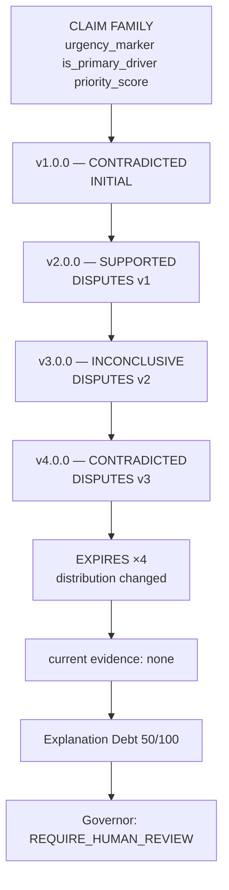
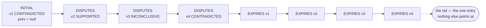
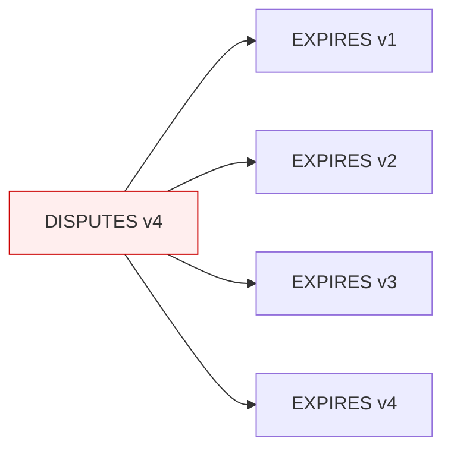

# Lineage and Explanation Debt

## Why lineage exists

A claim is not true or false. It is true *of a model version, under a data distribution,
within a validity window*. Lineage is the structure that keeps that qualification attached,
so "is this explanation trustworthy?" can be answered with "as of when?"



**What to notice.** The expiry step adds a row; it does not touch the four above it. The v2
SUPPORTED result is still exactly as true as it ever was — about the distribution it was
measured on. What changed is that it no longer describes today.

## Append-only, enforced

Nothing updates. Nothing deletes. A new result appends an entry whose `relation` states what
it does to its predecessor:

| Relation | When |
|---|---|
| `INITIAL` | first reading for this family |
| `SUPERSEDES` | a re-audit of the *identical* scope replaces the previous reading of it |
| `CONFIRMS` | a different version reached the same verdict |
| `DISPUTES` | a different version reached a different verdict |
| `EXPIRES` | a change invalidated a prior reading; names the entry it closes |

The relation is *derived*, never supplied by a caller. Letting an agent choose it would let
it rewrite what the history means without touching a single row.

"Current" is therefore a computed view: the latest non-expired entry whose validity window
covers the moment you are asking about. That is what makes point-in-time reconstruction real
rather than a stored flag someone has to remember to update.

### Three enforcement layers

1. **Frozen models.** Every domain object is `frozen=True`. Mutation raises.
2. **No write API.** `EvidenceLedger` exposes no `update_*` or `delete_*`. A test asserts
   its public surface contains none.
3. **Hash chain.** Each entry links to its predecessor's digest. Altering or removing an
   ancestor breaks every descendant, and `verify_integrity()` recomputes it on demand.

The chain is a linked list, and the distinction between that and "the rows in table order"
turned out to matter more than it sounds:



**The bug this replaced.** A distribution shift expires every prior reading in one call, so
all four `EXPIRES` rows carry the *same* `created_at`. The code found "the previous entry" by
taking the last row of a query ordered by `(created_at, id)` — and with the timestamps tied,
the tiebreak fell to `id`, which is a **content hash**. "Last" meant "largest hash", so three
of the four linked back to the same predecessor:



That failed in both directions at once. `verify_chain` compared links against sort order, so
it reported an untouched history as **broken** — and an integrity check that cries wolf is one
people stop reading. Meanwhile the chain really had forked, so an entire branch could be
dropped and a walk would never miss it.

Both operations are now properties of the links rather than of a sort: the tail is the entry
nothing points at, and `verify_chain` walks from the origin and reports whatever it cannot
reach. `tests/integration/test_lineage_chain_integrity.py` collapses the timestamps
deliberately; eleven of its tests fail against the old code. Every chain test that existed
before spaced its audits thirty days apart, where the tie cannot happen — which is the whole
reason nothing caught it.

There is one deliberate exception to strictness: re-appending a row with *identical
scientific content* is a no-op rather than an error. At-least-once delivery means the same
verdict can legitimately arrive twice, and a system that raised on that would be unusable.
Identity is judged on content with volatile metadata excluded — `created_at`,
`computed_at`, `executed_at`, `duration_ms` — because a deterministic experiment re-run
differs in exactly those fields and nothing else. Anything beyond them is a genuine conflict
and raises.

## Priority: the memory that makes autonomy targeted

When a new version deploys, Ariadne does not sweep every claim. It asks lineage which
explanations are most in doubt:

```
base                                    0.30
+ current verdict CONTRADICTED          +0.35
+ current verdict INCONCLUSIVE          +0.20
+ evidence older than the window        +0.15
+ nothing current at all                +0.30
+ per prior contradiction (max 0.20)    +0.10
+ any expired evidence                  +0.10
                                     → capped at 1.00
```

A claim contradicted on v1 comes out around 0.75 and is re-tested first. This is the answer
to "where is the agent?" — not that something ran, but that it chose *what* to run based on
what it remembered.

Whether that choice is worth anything is a separate, checkable question:
`benchmark/audit_priority_comparison.py` runs this exact formula against round-robin
scheduling under a constrained audit budget and finds a mean 75.8% reduction in audits
needed to re-test every previously-contradicted family (`docs/limitations.md` has the
scope and caveats).

## Explanation Debt

A decomposable operational risk score in [0, 100]. It answers one question: given everything
currently known about a model's explanations, how much unresolved explanation risk is
outstanding?

```
Debt = 25 × stale evidence ratio
     + 25 × contradiction ratio
     + 20 × inconclusive ratio
     + 15 × version inconsistency ratio
     + 15 × distribution sensitivity ratio
```

Each ratio is *claim families matching the condition ÷ total families*, and every component
reports its ratio, weight, resulting points, and the families that produced it. The schema
enforces `ratio × weight == points`, so the arithmetic can be checked rather than trusted.

### What debt is not

It is **not a scientific quantity**. The weights are a policy choice — someone's opinion
about which explanation problems deserve attention first. Two consequences follow, and both
are enforced in code:

- Every snapshot records its `policy_version`. Debt figures are not comparable across
  versions.
- Changing weights *requires* a new version string. `Policy.with_weights()` raises if you
  reuse the current one, because two incomparable scores that look comparable are worse than
  no score at all.

A `fingerprint()` hash over the actual numbers guards the case where someone edits a weight
and forgets to bump the version.

### A note on the design doc's example

`04-explanation-debt.md` in the original design pack (not in this repository) illustrates a
debt breakdown with
`Contradictions: +31` against a 25-point weight cap. Those numbers cannot both be right.

This implementation follows the weight table and reports computed values, so a demo shows
whatever the evidence produces — typically 25–55 across the four-version run. Reverse
engineering the illustrative total would have meant hardcoding a number the evidence does
not support, which is the specific thing the operating contract forbids.

## The Governor

Debt and lineage go in; exactly one action comes out. Rules are evaluated most-severe first,
first match wins:

| Condition | Action | Human? |
|---|---|---|
| debt ≥ 85 **and** currently contradicted | `PAUSE_AFFECTED_WORKFLOW` | required |
| debt ≥ 65, or ≥ 2 contradictions | `REQUIRE_HUMAN_REVIEW` | required |
| evidence expired or stale | `MARK_EXPLANATION_STALE` | no |
| currently contradicted | `INCREASE_AUDIT_PRIORITY` | no |
| currently inconclusive | `SCHEDULE_REAUDIT` | no |
| debt ≥ 25 | `SCHEDULE_REAUDIT` | no |
| currently supported | `STORE_EVIDENCE` | no |
| otherwise | `NO_ACTION` | no |

Pausing a workflow needs a high score *and* a live contradiction. A score alone is not
enough to interrupt anyone's work, and even then it stops at an approval request rather than
executing.

Gemini may recommend an action. `decide()` is a pure function that chooses one. The decision
records both, and the schema refuses to let `recommendation_accepted` disagree with what
actually happened — so "the model wanted to do less than the rules did" is countable rather
than anecdotal.
