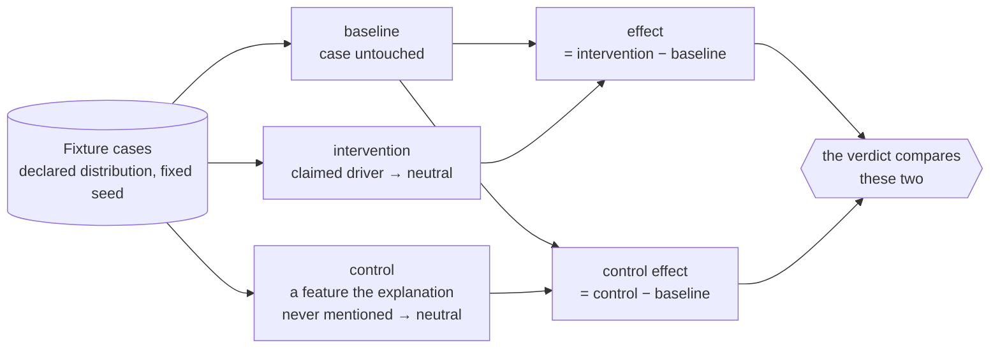
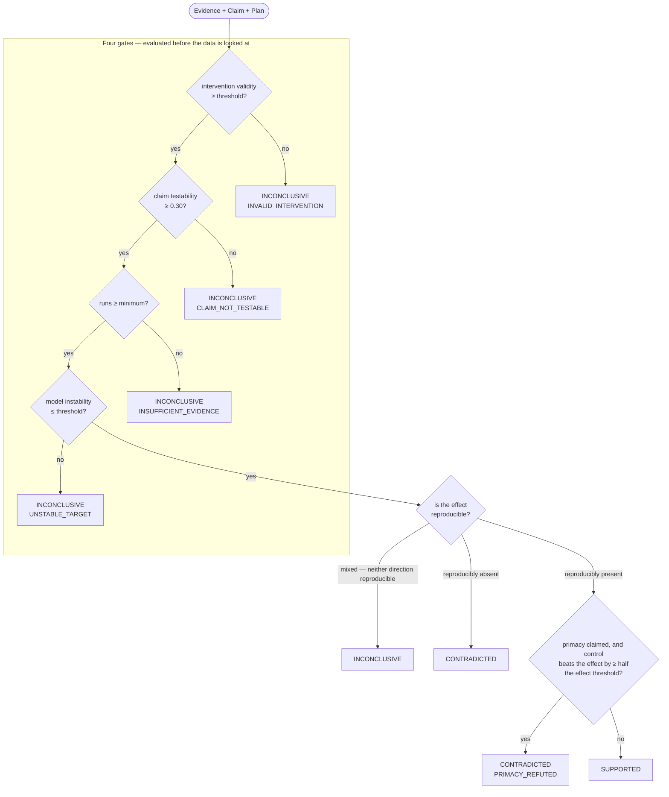

# The Executable Explanation Protocol

How a sentence becomes an experiment, and how the result becomes a verdict.

## 1. Compilation

An explanation is prose. A hypothesis is testable. Compilation is the step between.

```
Explanation:  "Urgency marker was the primary driver."

Claim:        subject     urgency_marker
              predicate   is_primary_driver
              object      priority_score
              primacy     true          ← "the primary", not merely "a"
              direction   decrease
              targets     [urgency_marker]
              preserved   [signal_b, signal_c]

Prediction:   IF urgency_marker is the primary driver of priority_score
              THEN setting urgency_marker to its neutral value, holding
                   signal_b and signal_c fixed
              SHOULD lower priority_score by at least 0.10
```

The `primacy` flag carries more weight than it looks. "Urgency was *the primary* driver" and
"urgency *contributed*" make different predictions, and the same measurements can support
one while refuting the other. Two benchmark cases exist purely to demonstrate this:
identical evidence, one CONTRADICTED and one SUPPORTED, because the claims differ.

This step needs a language model. Deciding whether a sentence asserts primacy, spotting that
"several factors contributed" states no hypothesis at all, noticing an unstated assumption —
rules do this badly.

What the Investigator cannot do is fixed by its manifest: it writes claims and nothing else.

## 2. Intervention design

The Experimenter proposes; deterministic code disposes.

| Element | Who decides | Why |
|---|---|---|
| Which variable to perturb | Experimenter | must be the claim's subject; validated |
| Which control to run | Experimenter | genuine judgement about the strongest competitor |
| What "neutralize" means | **the laboratory** | otherwise an agent could redefine it to prove nothing while looking rigorous |
| Which features are preserved | **computed** | an agent must not be able to shrink the constraint set that makes its own result meaningful |
| Which fixture cases run | **the distribution** | an agent must not select the data that flatters it |

That table is the answer to "isn't the LLM just doing whatever it wants?" — it proposes
within a space whose boundaries it does not control. A test confirms that an Experimenter
proposing `intervention_value: 0.94` for a neutralization still gets 0.5.

## 3. Execution

Three arms over the same fixture cases, in the same order:

- **baseline** — the case untouched
- **intervention** — the claimed driver set to its neutral value
- **control** — a different feature neutralized instead



**What to notice.** The control arm is why "the score moved" is not enough. If neutralizing a
feature the explanation never named moves the score *further* than neutralizing the one it
did, the explanation named the wrong driver — and the measurement that proves it is the
second delta. The ablation in `docs/evaluation.md` removes this arm and watches the false
support rate rise from 0% to 8%.

Pairing matters. Both arms run the same cases, so between-case variance cancels and the
remaining signal is attributable to the intervention rather than to which cases landed
where.

Every call records the hash of what went in and what came out. Every run is checkpointed as
it completes. Two replicate probes ask the model the same question twice, because a model
that disagrees with itself cannot be probed by a paired design at all.

## 4. Validity, before interpretation

An intervention can fail in two very different ways, and conflating them is the fastest way
to manufacture false contradictions.

**Invalid** — it changed something it promised to preserve, pushed a feature outside its
realistic range, or moved its target by less than 15% of the feature's range. An invalid
probe yields INCONCLUSIVE, because a broken test tells you nothing about the claim.

**Valid but unrevealing** — a clean intervention that simply did not move the output. That
is real evidence, and it is what CONTRADICTED is for.

Hard failures (scope violation, constraint violation, out-of-range) are combined across
cases with AND: one malformed case invalidates the probe. Adequacy is *averaged*, because a
single case that happened to start near the neutral value is a near-zero delta the paired
statistics already handle — zeroing the whole probe for it would report a strong experiment
as worthless.

## 5. The verdict



**What to notice.** Everything inside the box happens *before* a single measurement is
interpreted, and every exit from it is INCONCLUSIVE. That is the shape of the central claim:
a system that cannot reach a verdict says so, and the only path to CONTRADICTED or SUPPORTED
runs through four gates that each have their own way of saying "this experiment could not
answer the question."

Note also that CONTRADICTED has two distinct entrances. An effect can be reproducibly
*absent*, or reproducibly present but smaller than a control the explanation never mentioned
— and the second only refutes a claim that asserted **primacy**. Same measurements, different
claim, different verdict.

Rules are evaluated in this order, and the order is the design:

```
1. intervention_validity < threshold        → INCONCLUSIVE  (invalid probe)
2. claim testability < 0.30                 → INCONCLUSIVE  (vague claim)
3. runs < minimum                           → INCONCLUSIVE  (insufficient evidence)
4. model instability > threshold            → INCONCLUSIVE  (unstable target)
5. now, and only now, look at the data:
      observed_rate ≥ reproducibility_threshold        → effect reproducibly present
      (1 − observed_rate) ≥ reproducibility_threshold  → effect reproducibly absent
      otherwise                                        → INCONCLUSIVE  (mixed)
6. reproducibly absent                      → CONTRADICTED
7. primacy claim AND |control| − |effect| ≥ half the effect threshold
                                            → CONTRADICTED  (primacy refuted)
8. otherwise                                → SUPPORTED
```

Two details worth defending:

**Why "reproducibly absent" and not just "not observed."** An unreproducible result is
ambiguity, not refutation. Requiring the *absence* to be reproducible is what stops noise
from reading as evidence against a claim. This is why v3 — where the effect appears on 58%
of cases — comes out INCONCLUSIVE rather than either verdict.

**Why a margin on the control comparison.** Rule 7 requires the control to beat the claimed
driver by at least half the effect threshold, not merely to exceed it. A bare inequality
would let a verdict flip on a difference too small to have been measured.

The rationale string is composed from computed values only. Nothing narrates it, so the
sentence cannot drift from the numbers it describes.

## 6. What the verdict is scoped to

Every verdict carries a `VersionScope`: model ID, model version, distribution version — plus
the protocol version and verifier version that produced it. There is no way to construct a
`Verdict` without one.

That is the difference between "this explanation is unfaithful" and the claim Ariadne
actually makes: *under intervention protocol 1.0.0, against distribution baseline_2024.1,
on synthetic-triage v1.0.0, the predicted effect was reproducibly absent.*

The first sentence is an overclaim. The second is a result.

## 7. Faithfulness

The fleet-level metric:

```
Behavioral Explanation Faithfulness = supported / (supported + contradicted)
```

Inconclusive claims are reported separately and never folded in. Hiding them would let a
system improve its own score by making its probes worse — every claim it could not test
would simply vanish from the denominator.
